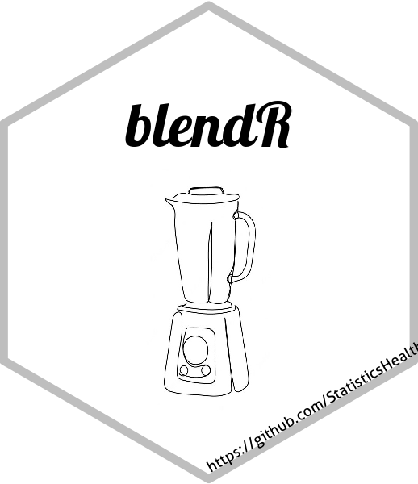

# blendR: An R package for blending survival curves 

<!-- badges: start -->
[](https://github.com/StatisticsHealthEconomics/blendR/actions/workflows/R-CMD-check.yaml)
<!-- badges: end -->

The goal of blendR is to _blend_ two survival curves together from one to the other according to some defined blending function.

## Installation

You can install the development version of blendR from [GitHub](https://github.com/) with:

``` r
# install.packages("devtools")
devtools::install_github("StatisticsHealthEconomics/blendR")
```

## Example

This is a basic example which shows you how to solve a common problem:

```r
library(blendR)
library(survHE)

## trial data
data("TA174_FCR", package = "blendR")

## externally estimated data
data_sim <- ext_surv_sim(t_info = 144,
                         S_info = 0.05,
                         T_max = 180)
                         
obs_Surv <- fit.models(formula = Surv(death_t, death) ~ 1,
                        data = dat_FCR,
                        distr = "exponential",
                        method = "hmc")
                        
ext_Surv <- fit.models(formula = Surv(time, event) ~ 1,
                       data = data_sim,
                       distr = "exponential",
                       method = "hmc")
                       
blend_interv <- list(min = 48, max = 150)
beta_params <- list(alpha = 3, beta = 3)

ble_Surv <- blendsurv(obs_Surv, ext_Surv, blend_interv, beta_params)

plot(ble_Surv)
```

## Licence
[](https://www.gnu.org/licenses/gpl-3.0)

## Contributing
Please submit contributions through `Pull Requests`, following the [contributing
guidelines](https://github.com/StatisticsHealthEconomics/blendR/blob/dev/CONTRIBUTING.md).
To report issues and/or seek support, please file a new ticket in the
[issue](https://github.com/StatisticsHealthEconomics/blendR/issues) tracker.

Please note that this project is released with a [Contributor Code of Conduct](https://github.com/StatisticsHealthEconomics/blendR/blob/dev/CONDUCT.md). By participating in this project you agree to abide by its terms.
