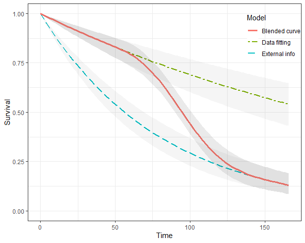

# Summary

The goal of `blendR` is to provide functionality to *blend* two survival
curves together from one to the other according to some defined blending
function.

Survival extrapolation is essential in cost-effectiveness analysis to
quantify the lifetime survival benefit associated with a new
intervention, due to the restricted duration of randomized controlled
trials (RCTs). Current approaches of extrapolation often assume that the
treatment effect observed in the trial can continue indefinitely, which
is unrealistic and may have a significant impact on decisions for
resource allocation.

Blended survival curves are a possible solution to alleviate the problem
of survival extrapolation with heavily censored data from clinical
trials. The main idea is to mix a flexible model (e.g., Cox
semiparametric model) to fit as well as possible the observed data and a
parametric model encoding assumptions on the expected behaviour of
underlying long-term survival. The two are "blended" into a single
survival curve that is identical with the first model over the range of
observed times and gradually approaching the parametric model over the
extrapolation period based on a weight function. The weight function
regulates the way two survival curves are blended, determining how the
internal and external sources contribute to the estimated survival over
time. Long-term extrapolation from immature trial data may lead to
significantly different estimates with various modelling assumptions.
The blending approach provides sufficient flexibility, allowing a wide
range of plausible scenarios to be considered as well as the inclusion
of external information, based, for example, on hard data or expert
opinion.

# Statement of need

Interim analyses of trials with limited follow-up are often subject to
high degrees of administrative censoring, which may result in
implausible long-term extrapolations using standard approaches
[@NICE_TSD14]. Implementing an innovative methodology based on
"blending" survival curves to relax the traditional proportional hazard
assumption and simultaneously incorporate external information can guide
the extrapolation [@Che2022]. The `blendR` package provides a simple and
powerful means to allow a careful consideration of a wide range of
plausible scenarios, accounting for model fit to the short-term data as
well as the plausibility of long-term extrapolations. `blendR` was
designed to be used by statisticians, health economists, healthcare
professionals and other users of survival data.

# Method

The *blending* idea is to consider two separate processes to describe
the long-term horizon survival. The first one is driven exclusively by
the observed data. Similar to a *standard* health technology assessments
(HTA), this is used to determine an estimate over the entire time
horizon of a survival curve, termed
$S_{obs}(t \mid \boldsymbol{\theta}_{obs})$, a function of the relevant
parameters $\boldsymbol{\theta}_{obs}$. A simple parametric model could
be chosen, or alternatively, some other more complex model, with the
main objective to produce the *best* fit possible to the observed
information. Unlike in a standard modelling exercise where the issue of
overfitting is potentially critical, achieving a very close
approximation to the observed dynamics has much less important
implications in the case of blending, as explained further below.
Common packages available in R for this step include `survHE` [@survHE] and `flexsurv` [@flexsurv].

For the second component of the blending process, consider a separate
*external* survival curve, ${S_{ext}(t\mid\boldsymbol{\theta}_{ext})}$.
This is a parametric model that is not informed by the observed data -
for instance, "hard"" information could be used, e.g. derived from a
different data source (such as registries or observational studies), or
construct a model that is purely based on subjective knowledge elicited
from experts, or possibly a combination of the two. Either way,
$S_{ext}(t\mid\boldsymbol{\theta}_{ext})$ will typically be less
concerned with the observed portion of the time horizon, but is
instrumental to produce a reasonable and realistic *long-term* estimate
for the survival probabilities.

The *blended* survival curve is defined as

\begin{align}
    S_{ble}(t\mid\boldsymbol{\theta}) =
    S_{obs}(t\mid\boldsymbol{\theta}_{obs})^{1-\pi(t; \alpha, \beta, a, b)}\times S_{ext}(t\mid\boldsymbol{\theta}_{ext})^{\pi(t;\alpha, \beta, a, b)}
\label{ble_for}
\end{align} where
$\boldsymbol{\theta} = \{\boldsymbol{\theta}_{obs}, \boldsymbol{\theta}_{ext}, \alpha, \beta, a, b\}$
is the vector of model parameters. Here, $\pi(\cdot)$ is a weight
function that controls the extent to which the two survival curves
$S_{obs}(\cdot)$ and $S_{ext}(\cdot)$ are blended together. Technically,
define $\pi(\cdot)$ as the cumulative distribution function of a Beta
random variable with parameters $\alpha,\beta > 0$, evaluated at the
point $(t-a)/(b-a)$.

\begin{align*}
    \pi(t;\alpha,\beta,a,b) = \Pr\left(T\leq \frac{t-a}{b-a}\mid \alpha,  \beta\right) =
    F_{\text{Beta}}\left (\frac{t-a}{b-a}\mid \alpha, \beta \right),
\end{align*} for $t \in [0,T^*]$, where $T^*$ is the upper end of the
interval of times over which to perform our evaluation. This means that
the weighting function $\pi(\cdot)$ varies over the time horizon, which
in turn allows us to give different weight to the two components at
different times $t$. The range $[a, b]\in (0,T^*)$ is the *blending
interval*, i.e. a subset of the life-time horizon in which
$S_{obs}(\cdot)$ and $S_{ext}(\cdot)$ are blended into a single survival
curve.

Figure \autoref{fig:figure} depicts this process graphically. In this
case, it is assumed that the trial data span over the interval $[0,a]$,
which is labelled in the graph as the "Follow-up". The dashed curve is
the Kaplan-Meier (KM) estimate of the observed data (for simplicity, but
without loss of generality, consider here a single arm). The curve
labelled as $S_{obs}$ results from a suitable model fitted to the
observed data, in order to capture the known features of the data
generating process almost to perfection - as is possible to appreciate
in the graph, the KM curve is basically identical with the model
obtained with $S_{obs}$.

The blue curve, indicated as $S_{ext}$ should be used to give
information about the expected long-term behaviour of the survival
process. While it may be difficult to directly access hard data to
inform this it is often possible and generally desirable to so. For
example, experts may have individual level data from a registry based on
use of a drug with a similar mechanism to the one they are assessing in
the trial; or perhaps they have elicited clinical knowledge or expert
opinion to identify that survival at a certain time point is not
expected to exceed a certain threshold. Notice in particular that
$S_{ext}$ can deviate substantially from the observed data, as shown in
Figure \autoref{fig:figure}.

![Graphical representation of the blended curve method. The whole
time-horizon is partitioned into three parts: Follow-up, Blending
interval and Long term. The blended survival is equivalent to the model
fitted to the short-term data (purple Kaplan-Meier curve) within
Follow-up period (green curve); then gradually approaching the external
estimate in the Blending interval (red curve); eventually consistent
with the expected behaviour (blue curve) in the Long term. The black
point in the Long term is an example of external information about 10%
expected survival at the 13 years from
experts.\label{fig:figure}](figure.jpeg){width="80%"}

# Example

We present a basic example which demonstrates how to solve a common
problem. Using the *TA174_FCR* data set contained in the `blendR`
package, we fit exponential distribution survival models with no
covariates using the `fit.models()` function from the `survHE` package
[@survHE]. This employs the Hamiltonian Monte Carlo (HMC) sampler from
Stan behind the scenes [@stan2017]. The *external* or *long-term* data
are obtained from an heuristic approach to simulating data consistent
with user-defined constraints. The results are then blended into a
single survival curve using the `blendsurv()` function.

``` r
library(blendR)
library(survHE)

## trial data
data("TA174_FCR", package = "blendR")

## externally estimated data
data_sim <- ext_surv_sim(t_info = 144,
                         S_info = 0.05,
                         T_max = 180)
    
# observed survival model                     
obs_Surv <- survHE::fit.models(formula = Surv(death_t, death) ~ 1,
                               data = dat_FCR,
                               distr = "exponential",
                               method = "hmc")
                        
# external survival model               
ext_Surv <- survHE::fit.models(formula = Surv(time, event) ~ 1,
                               data = data_sim,
                               distr = "exponential",
                               method = "hmc")
                       
blend_interv <- list(min = 48, max = 150)
beta_params <- list(alpha = 3, beta = 3)

# blended survival model
ble_Surv <- blendsurv(obs_Surv, ext_Surv, blend_interv, beta_params)

plot(ble_Surv)
```

{width="50%"}

# References
